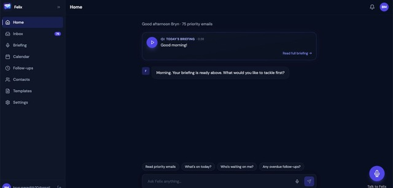
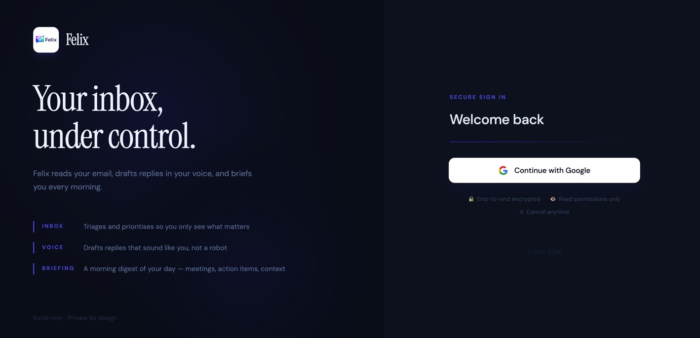

# Felix

An AI email and calendar chief of staff. Felix connects to your Gmail and Google Calendar, triages your inbox, drafts replies in your voice, tracks follow-ups, and gives you a spoken morning briefing. Invite-only, fully self-hosted, every user's data is completely siloed.

## Screenshots

### Dashboard


### Landing Page

---

## What it does

- **Inbox triage** — every incoming email is classified (action required / FYI / waiting on / newsletter / automated / VIP), assigned urgency and sentiment, and labelled in Gmail automatically
- **Draft replies** — Claude analyses your sent email history to learn your writing style, then pre-writes replies ready for your one-click approval
- **Follow-up tracking** — outbound emails that need a reply are monitored; Felix drafts and alerts you when they go cold
- **Voice interface** — speak to Felix to read emails, reply, schedule meetings, or get a summary
- **Morning briefing** — a spoken daily briefing covering priority emails, today's calendar, and overdue follow-ups
- **Relationship intelligence** — a living profile per contact: interaction history, open commitments, sentiment trends, relationship strength
- **Templates** — reusable email templates by category (reply, outreach, follow-up)
- **Writing style** — Felix analyses your sent mail to learn your tone and applies it to every generated draft

---

## Stack

| Layer | Technology |
|---|---|
| Frontend | Next.js 14.2 (App Router), React 18, TypeScript, Tailwind CSS 3.4, SWR |
| Backend | FastAPI (Python 3.12) |
| Hosting | Frontend on **Vercel**, Backend on **Railway** |
| Auth | Supabase Auth with Google OAuth |
| Database | Supabase PostgreSQL with Row Level Security |
| AI | Claude Sonnet 4.6 (drafts / analysis) · Claude Haiku 4.5 (triage / routing) |
| Voice | Google Cloud Speech-to-Text V2 · ElevenLabs Turbo v2.5 |
| Google APIs | Gmail API · Google Calendar API |
| Scheduler | APScheduler (inbox sync every 2 min, briefings, nightly relationship refresh) |
| Key libs | anthropic, asyncpg, httpx, cryptography (Fernet), recharts, lucide-react, dompurify |

---

## Project structure

```
felix/
├── backend/
│   ├── app/
│   │   ├── main.py              # FastAPI entry point, lifespan, CORS, router registration
│   │   ├── config.py            # Pydantic settings (all env vars)
│   │   ├── db.py                # asyncpg pool helpers (query/query_one/execute/insert/upsert)
│   │   ├── middleware/
│   │   │   └── auth.py          # JWT validation + get_current_user / get_google_credentials
│   │   ├── api/                 # Route handlers — one file per domain
│   │   │   ├── auth.py          #   Google OAuth connect/callback/disconnect/status
│   │   │   ├── email.py         #   Inbox list, draft generation (SSE), send, discard
│   │   │   ├── calendar.py      #   Event listing, today summary, free-slot finder
│   │   │   ├── briefing.py      #   Daily briefing generate/today/history/listened
│   │   │   ├── contacts.py      #   Contact directory + relationship profiles
│   │   │   ├── follow_ups.py    #   Follow-up list/close/snooze/send/draft
│   │   │   ├── voice.py         #   WebSocket STT/TTS pipeline
│   │   │   ├── polish.py        #   Draft polish/refinement endpoint
│   │   │   ├── settings.py      #   User settings + VIP contacts + style analysis
│   │   │   ├── templates.py     #   Email templates CRUD
│   │   │   └── eval.py          #   AI feedback logging + admin routes
│   │   ├── services/            # Business logic and API integrations
│   │   │   ├── ai_service.py           # Claude: triage, draft, sentiment, style analysis
│   │   │   ├── gmail_service.py        # Gmail sync, thread fetch, send
│   │   │   ├── calendar_service.py     # Google Calendar events, conflicts, free slots
│   │   │   ├── briefing_service.py     # Morning briefing generation + audio
│   │   │   ├── voice_service.py        # ElevenLabs TTS + Google STT
│   │   │   ├── voice_router.py         # Route voice commands to handlers
│   │   │   ├── follow_up_engine.py     # Detect cold outbound emails, draft follow-ups
│   │   │   ├── relationship_engine.py  # Build contact relationship profiles
│   │   │   ├── style_profiler.py       # Learn user writing style from sent mail
│   │   │   ├── sentiment_analyser.py   # Per-email sentiment scoring
│   │   │   ├── polish_service.py       # Polish draft text
│   │   │   ├── google_api.py          # Shared Google API auth helpers
│   │   │   └── timezone_utils.py       # Timezone helpers
│   │   ├── jobs/                # APScheduler background tasks
│   │   │   ├── scheduler.py            # Job registration, get_active_users()
│   │   │   ├── inbox_sync.py           # Gmail sync every 2 minutes
│   │   │   ├── briefing_generator.py   # Generate briefing at user's briefing_time
│   │   │   ├── digest_sender.py        # Send digest emails at digest_times
│   │   │   ├── follow_up_checker.py    # Nightly cold-email detection
│   │   │   └── relationship_updater.py # Nightly relationship profile refresh
│   │   ├── models/              # Pydantic request/response models
│   │   └── prompts/             # All Claude system prompts (one file per feature)
│   ├── tests/
│   ├── requirements.txt
│   └── Dockerfile               # Railway deploy — python:3.12-slim
│
├── frontend/
│   └── src/
│       ├── app/
│       │   ├── (auth)/          # Public routes (no session required)
│       │   │   ├── login/       #   Supabase sign-in page
│       │   │   ├── callback/    #   Google OAuth callback handler
│       │   │   ├── connect/     #   Link Google account
│       │   │   └── onboarding/  #   First-run setup (name, timezone, briefing time)
│       │   └── (app)/           # Protected routes (session required)
│       │       ├── dashboard/   #   Overview widgets (inbox, calendar, follow-ups, briefing)
│       │       ├── inbox/       #   Email list with triage tabs
│       │       │   └── [id]/    #     Email detail + draft compose panel
│       │       ├── calendar/    #   Week-view calendar + free-slot finder
│       │       ├── briefing/    #   Today's briefing + audio player + history
│       │       ├── contacts/    #   Contact directory
│       │       │   └── [email]/ #     Contact profile (stats, sentiment chart, history)
│       │       ├── follow-ups/  #   Follow-up tracker with send/close/snooze
│       │       ├── templates/   #   Email templates CRUD
│       │       ├── settings/    #   Profile, schedule, Gmail, VIPs, writing style
│       │       └── admin/       #   Admin panel
│       ├── components/          # React components, organised by feature
│       │   ├── layout/          #   AppShell, Sidebar
│       │   ├── email/           #   EmailDetail, DraftPanel, ContactSidebar
│       │   ├── inbox/           #   EmailCard, EmailList
│       │   ├── calendar/        #   WeekGrid, EventCard
│       │   ├── contacts/        #   RelationshipChart
│       │   ├── follow-ups/      #   FollowUpCard
│       │   ├── templates/       #   TemplateEditor
│       │   └── felix/           #   VoiceOrb, VoiceModal, TranscriptDisplay
│       ├── hooks/               # Data-fetching and UI hooks
│       │   ├── useEmails.ts     #   Paginated inbox with SWR infinite scroll
│       │   ├── useDraft.ts      #   Draft lifecycle (load → stream → edit → send)
│       │   ├── useCalendar.ts   #   Calendar events
│       │   ├── useFollowUps.ts  #   Follow-up list + client-side filtering
│       │   ├── useUnreadCounts.ts
│       │   └── useVoice.ts      #   WebSocket STT/TTS state machine
│       ├── lib/
│       │   ├── api.ts           # fetch wrapper with auth, 401/403 redirects, streaming
│       │   ├── supabase.ts      # Supabase browser client
│       │   ├── supabase-server.ts # Supabase server-side client (SSR)
│       │   └── types.ts         # TypeScript interfaces (Email, Draft, Contact, etc.)
│       └── middleware.ts        # Session refresh for all routes
│
├── infra/
│   ├── schema.sql               # Supabase schema — all tables + RLS policies
│   └── migrations/              # Incremental SQL migrations (001–005)
│       ├── 001_phase2_email_fields.sql
│       ├── 002_phase7_smart_templates.sql
│       ├── 003_oauth_nonces.sql
│       ├── 004_eval_infrastructure.sql
│       └── 005_schema_hardening.sql
├── .env.example
├── CLAUDE.MD                    # Architecture rules and build phases
└── FELIX_BUILD_PLAN.md          # Full technical specification
```

---

## Setup

### Prerequisites

- Node.js 18+ and npm
- Python 3.12+
- A [Supabase](https://supabase.com) project
- A GCP project with Gmail API, Calendar API, and Speech-to-Text API enabled
- An Anthropic API key
- An ElevenLabs API key (optional — only required for voice briefing audio)

### 1. GCP / Google OAuth

In the [GCP Console](https://console.cloud.google.com):

```bash
# Enable required APIs
gcloud services enable \
  gmail.googleapis.com \
  calendar-json.googleapis.com \
  speech.googleapis.com \
  run.googleapis.com \
  secretmanager.googleapis.com
```

Go to **APIs & Services → OAuth consent screen**:
- User type: External
- Publishing status: **Testing** (keep it here permanently — you don't need to publish)
- Scopes: add Gmail + Calendar scopes listed in `backend/app/api/auth.py`
- **Test Users**: add every Google email that needs access — anyone not on this list is blocked

Go to **Credentials → Create OAuth Client ID → Web application**, add redirect URIs:
- `http://localhost:8000/auth/google/callback` (local)
- `https://your-railway-url/auth/google/callback` (production)

### 2. Supabase

- Create a project at [supabase.com](https://supabase.com)
- Go to **Authentication → Providers → Google** and paste your Google OAuth client ID and secret
- Go to **SQL Editor** and run the contents of `infra/schema.sql`
- Go to **Settings → Database → Connection string** and copy the Session mode pooler URL (port 5432) — this is your `DATABASE_URL`

### 3. Environment variables

```bash
cp .env.example backend/.env
```

Fill in `backend/.env` — every variable is documented in `.env.example`. Key ones:

| Variable | Where to get it |
|---|---|
| `GOOGLE_CLIENT_ID` / `GOOGLE_CLIENT_SECRET` | GCP Console → Credentials |
| `GOOGLE_REDIRECT_URI` | `http://localhost:8000/auth/google/callback` for local |
| `SUPABASE_URL` / `SUPABASE_SERVICE_KEY` | Supabase → Settings → API |
| `DATABASE_URL` | Supabase → Settings → Database → Connection string (Session mode) |
| `FRONTEND_URL` | Must exactly match your active frontend origin (including protocol, no trailing slash). Use `http://localhost:3000` for local; in Codespaces use `https://<name>-3000.app.github.dev` |
| `TOKEN_ENCRYPTION_KEY` | `openssl rand -hex 32` |
| `ANTHROPIC_API_KEY` | [console.anthropic.com](https://console.anthropic.com) |
| `ELEVENLABS_API_KEY` / `FELIX_VOICE_ID` | [elevenlabs.io](https://elevenlabs.io) |

Create `frontend/.env.local`:

```bash
NEXT_PUBLIC_API_URL=http://localhost:8000
NEXT_PUBLIC_SUPABASE_URL=https://xxxx.supabase.co
NEXT_PUBLIC_SUPABASE_ANON_KEY=your-anon-key
```

### Codespaces OAuth checklist (important)

Codespaces uses different public hosts per port (for example `...-3000.app.github.dev` for frontend and `...-8000.app.github.dev` for backend). A mismatch in any URL below causes OAuth errors or 404s.

1. **Supabase Auth → URL Configuration**
   - Site URL: your current frontend host (port 3000), e.g. `https://<codespace>-3000.app.github.dev`
   - Redirect URLs (allow list): include **exactly**:
     - `https://<codespace>-3000.app.github.dev/auth/callback` (Supabase sign-in callback)
2. **Do not use `/auth/exchange` in Supabase redirect URLs**
   - Felix uses `/auth/callback` (see `frontend/src/app/auth/callback/page.tsx`).
3. **Google Cloud OAuth client (Credentials → Web application)**
   - Authorized redirect URI must include your backend callback URL:
     - `https://<codespace>-8000.app.github.dev/auth/google/callback`
4. **Backend env (`backend/.env`)**
   - `GOOGLE_REDIRECT_URI` must match the Google OAuth redirect URI above exactly.
   - `FRONTEND_URL` must match the frontend 3000 host exactly (no trailing slash).
5. **Frontend env (`frontend/.env.local`)**
   - `NEXT_PUBLIC_API_URL` must match backend 8000 host exactly.
6. **After each Codespace restart**
   - Re-check all URLs above; if hostname changed, update Supabase + GCP + env vars.

### 4. Run locally

**Backend:**

```bash
cd backend
python -m venv .venv && source .venv/bin/activate
pip install -r requirements.txt
uvicorn app.main:app --reload --port 8000
```

API at `http://localhost:8000` — interactive docs at `http://localhost:8000/docs`.

**Frontend:**

```bash
cd frontend
npm install
npm run dev
```

App at `http://localhost:3000`.

---

## Adding a user

Felix is invite-only. To grant someone access:

1. GCP Console → APIs & Services → OAuth consent screen → Test Users → **Add Users**
2. Enter their Google email address → Save
3. Send them the app URL
4. They sign in with Google → connect Gmail & Calendar → Felix starts syncing

To revoke access: remove from Test Users and delete their row from `auth.users` in Supabase.

---

## Architecture rules

These apply everywhere in the codebase, no exceptions:

- **Every FastAPI route** uses `Depends(get_current_user)` from `middleware/auth.py`
- **Every database table** has a `user_id` column and an RLS policy
- **Every database write** includes `user_id` — RLS is a safety net, not a substitute
- **Background jobs** call `get_active_users()` and iterate — never hardcoded to one user
- **Google credentials** are loaded per-request via `get_google_credentials(user_id)` — never stored in env vars
- **All user config** (timezone, briefing time, style profile, VIPs) lives in the `settings` table

---

## Build phases

| Phase | Status | Scope |
|---|---|---|
| 1 — Auth + Google Connection | ✅ | Supabase JWT, Google OAuth, encrypted token storage, onboarding |
| 2 — Inbox Triage + Drafts | ✅ | Gmail sync, Claude triage, style profiling, SSE draft streaming |
| 3 — Voice Layer | ✅ | WebSocket STT/TTS pipeline, voice commands, VoiceOrb UI |
| 4 — Calendar + Briefing | ✅ | Calendar API, week-view, morning briefing generation + audio |
| 5 — Follow-up Engine | ✅ | Outbound email tracking, cold-email detection, auto-draft follow-ups |
| 6 — Relationship Intelligence | ✅ | Contact profiles, sentiment trends, relationship strength, commitment tracking |
| 7 — Polish | ✅ | Templates, digest mode, writing style analysis, draft refinement |

---

## Deployment

**Backend — Railway**

The backend deploys to [Railway](https://railway.app) using the Dockerfile at `backend/Dockerfile`. Set all required environment variables (`DATABASE_URL`, `ANTHROPIC_API_KEY`, `GOOGLE_CLIENT_ID`, `GOOGLE_CLIENT_SECRET`, `GOOGLE_REDIRECT_URI`, `TOKEN_ENCRYPTION_KEY`, `SUPABASE_URL`, `SUPABASE_SERVICE_KEY`, `FRONTEND_URL`, etc.) in the Railway service dashboard.

**Frontend — Vercel**

The frontend deploys to [Vercel](https://vercel.com). Set these environment variables in the Vercel dashboard:

- `NEXT_PUBLIC_API_URL` — your Railway backend URL
- `NEXT_PUBLIC_SUPABASE_URL` — your Supabase project URL
- `NEXT_PUBLIC_SUPABASE_ANON_KEY` — your Supabase anon key

After deploying, update your Google OAuth redirect URI and Supabase Site URL / Redirect URLs to match the production domains.
