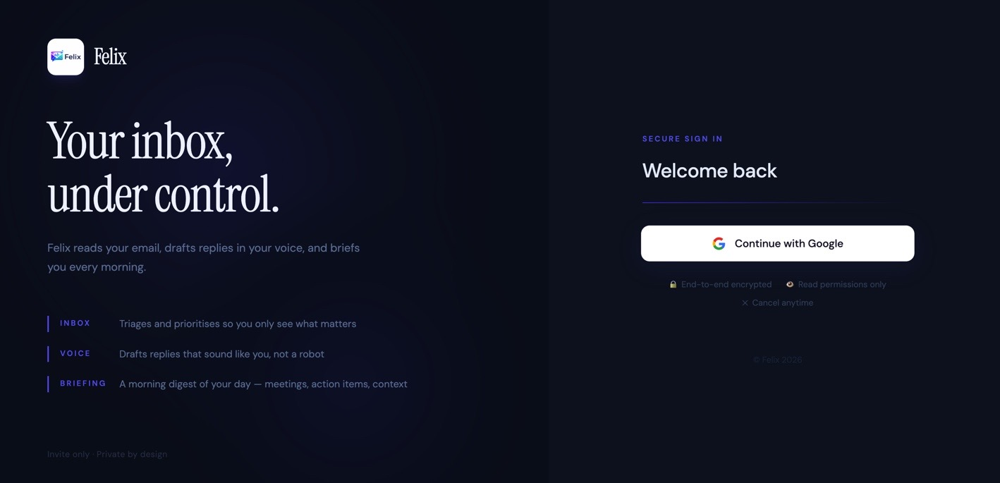
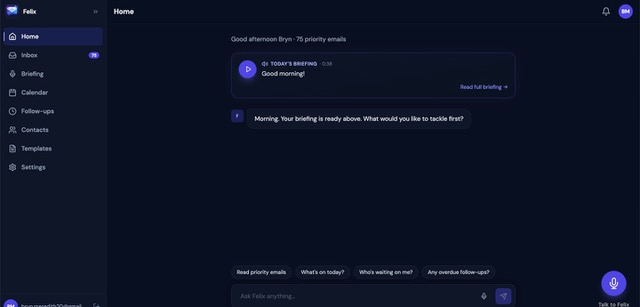

# Felix

Felix is an AI chief of staff for Gmail, Google Calendar, and meetings. It triages and searches mail, drafts replies in the user's writing style, tracks follow-ups and commitments, prepares briefings, captures and summarizes meetings, offers optional Live Assist, and can maintain a gated job-application board.





## How it is built

The browser app is Next.js 14 with Supabase Auth. A FastAPI backend owns business logic, per-user Google OAuth credentials, Gmail/Calendar/Speech integrations, Anthropic model calls, ElevenLabs speech, scheduled work, and direct access to Supabase PostgreSQL. User-owned data is isolated by explicit `user_id` scoping plus PostgreSQL Row Level Security.

For the detailed subsystem, database, WebSocket, deployment, and multi-instance reference, read [`docs/ARCHITECTURE.md`](docs/ARCHITECTURE.md). Contributors and coding agents must also follow [`CLAUDE.md`](CLAUDE.md).

## Prerequisites

- Node.js 20 and npm (matching CI)
- Python 3.12
- A Supabase project
- A Google Cloud project with Gmail, Calendar, and Speech-to-Text APIs enabled
- Anthropic and ElevenLabs API credentials
- Optional: an OpenAI API key for semantic episode embeddings; memory falls back to non-vector retrieval without it

## Setup

### 1. Configure Supabase and Google OAuth

Create a Supabase project and enable its Google Auth provider. There are two related redirect flows:

1. Supabase sign-in returns to the frontend at `http://localhost:3000/auth/callback` (add the production equivalent to Supabase's redirect allowlist).
2. Felix's separate Gmail/Calendar authorization returns to the backend at `http://localhost:8000/auth/google/callback` (set the production equivalent as `GOOGLE_REDIRECT_URI`).

The Google OAuth client must allow the Supabase provider callback shown in the Supabase dashboard and the Felix backend callback. The Gmail and Calendar scopes used by the application are defined in `backend/app/api/auth.py`.

### 2. Create the database

In the Supabase SQL editor, apply:

1. `infra/schema.sql`
2. Every file in `infra/migrations/`, in numeric order through the latest migration

Use a Supabase **session-mode** database URL on port 5432. The backend's cross-instance advisory locks do not work correctly through transaction-mode port 6543.

### 3. Configure environment variables

```bash
cp .env.example backend/.env
```

Fill every required backend value documented in `.env.example`. Generate fresh secrets where indicated. If semantic embeddings are wanted, also set `OPENAI_API_KEY`; it is optional and intentionally not part of validated startup settings.

Create `frontend/.env.local`:

```dotenv
NEXT_PUBLIC_API_URL=http://localhost:8000
NEXT_PUBLIC_SUPABASE_URL=https://YOUR_PROJECT.supabase.co
NEXT_PUBLIC_SUPABASE_ANON_KEY=YOUR_ANON_KEY
```

Never put the Supabase service key or provider secrets in a `NEXT_PUBLIC_*` variable. `FRONTEND_URL`, `GOOGLE_REDIRECT_URI`, `NEXT_PUBLIC_API_URL`, and the Supabase/Google redirect allowlists must match their actual origins exactly. In Codespaces, ports 3000 and 8000 have different public origins and may change after a restart.

### 4. Install and run

Backend:

```bash
cd backend
python3 -m venv .venv
source .venv/bin/activate
pip install -r requirements.txt -r requirements-dev.txt
uvicorn app.main:app --reload --port 8000
```

Frontend, in a second terminal:

```bash
cd frontend
npm ci
npm run dev
```

Open `http://localhost:3000`. The API health check is `http://localhost:8000/health`, and FastAPI's local API explorer is at `http://localhost:8000/docs`.

## Checks

These are the same core checks run by CI:

```bash
cd backend && python -m pytest -q
cd frontend && npx tsc --noEmit
cd frontend && npm test
```

## Deployment

The repository's backend deployment configuration is `railway.toml`, which installs `backend/requirements.txt` and starts Uvicorn. `backend/Dockerfile` provides a separate Python 3.12 container build. See the deployment and runtime caveats in [`docs/ARCHITECTURE.md`](docs/ARCHITECTURE.md) before changing process counts, database pool mode, scheduler behavior, or WebSocket ownership.
